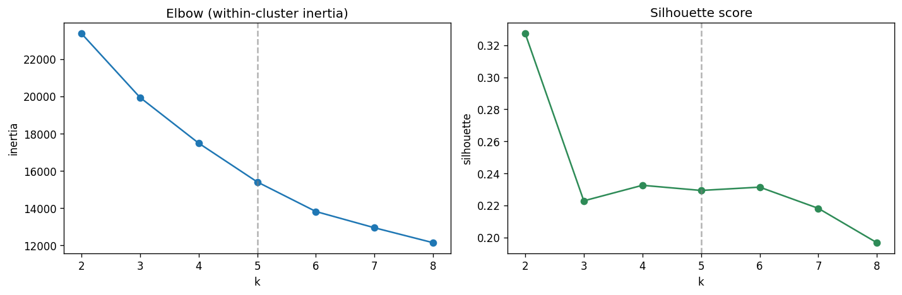
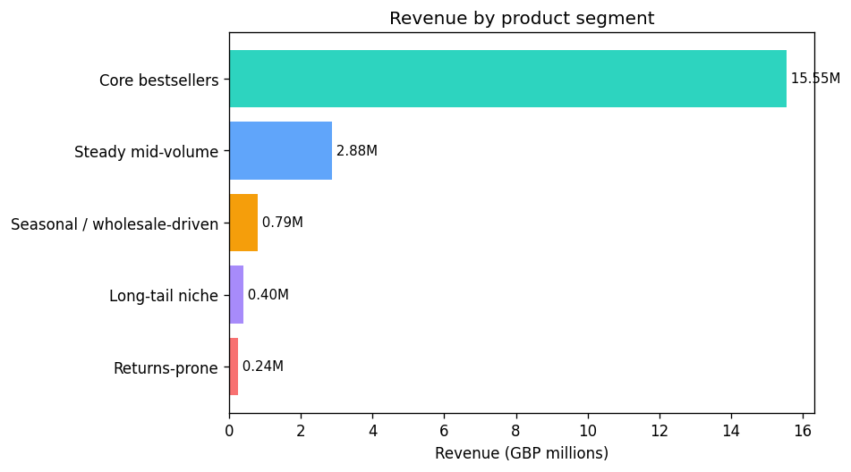
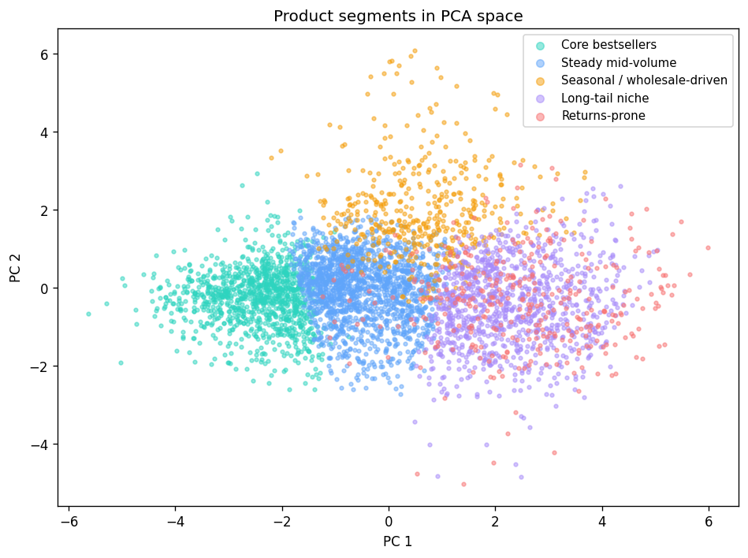

# What Kind of Product Is This? Segmenting a Catalog with Clustering

## The problem

Most retailers manage their catalog with one number: revenue. Sort the products, protect the top, ignore the tail. That ranking is easy to build and it hides the thing a merchandiser actually needs to know, which is how a product behaves. Two products can sit side by side on a revenue list and need completely opposite handling. One sells steadily to hundreds of customers. The other sold once, in bulk, to a single wholesale buyer in November. A ranking calls them equals.

This project takes a UK online gift retailer's full transaction history, about 1.06M order lines from December 2009 to December 2011, and asks a different question. If you describe each product by its real sales behavior and let the data group the products on its own, what segments appear, and what should the retailer do differently for each one?

## The approach

I aggregated the transaction log up to one row per product, 4,479 products with real selling history, and built eight features per product: total revenue, units sold, order frequency, customer reach, average price, return rate, demand seasonality (how spiky the monthly sales are), and customer concentration (how much the product leans on its single biggest buyer).

The monetary and count features are badly skewed, since a handful of products dwarf everything else, so I log-transformed them and standardized all eight so each feature gets an equal say. Then k-means. There is no right answer handed to you in clustering, so I picked the number of segments using the elbow of within-cluster spread together with the silhouette score, and settled on five.

## The five segments

**Core bestsellers.** 1,081 products, 24% of the catalog, but 78% of revenue. They sell fast, to a broad base, at low prices, and rarely come back. This is the engine. The job here is availability: never stock out.

**Steady mid-volume.** 1,607 products carrying another 14% of revenue. The dependable middle of the catalog. Not glamorous, but it is most of what keeps the lights on after the bestsellers.

**Seasonal and wholesale-driven.** 450 products with lumpy monthly demand and a heavy lean on one buyer (the top customer accounts for 42% of the product's revenue, against 10% for the bestsellers). Their average sales month is meaningless. They need to be managed by lead time and buyer relationship, because the demand arrives in a few concentrated bursts.

**Long-tail niche.** 994 products, a fifth of the catalog, that together make 2% of revenue. They sell rarely, to very few customers, at the highest prices in the store. Some are deliberate specialty items worth keeping. Many are prune candidates.

**Returns-prone.** 347 products with a median return rate of 96%. Whatever revenue they post, customers are sending most of the units back. That is a quality or fit problem, and it is invisible on a revenue report.

## Why this beats a revenue ranking

The honest test of a project like this is whether clustering tells you anything a simple ABC/Pareto split would not. So I built the ABC split too. Pareto holds: the top 23% of products make 80% of revenue, the classic shape.

But look at what ABC class A actually contains. It is not just bestsellers. Inside that top revenue tier sit 80 steady items, 38 seasonal products that depend on a single wholesale buyer, and 12 returns-prone products bleeding most of their units back. A flat ranking gives one instruction for all of class A: protect it. The clustering says those 12 returns-prone products in the top tier are a problem to fix, not an asset to protect, and the 38 seasonal ones will stock out or overstock if you plan them on an average.

It cuts the other way too. The returns-prone and seasonal segments are spread across all three ABC classes, which means you cannot manage returns or seasonality by revenue tier at all. The behavior does not line up with the revenue rank, and that mismatch is the whole point.

## What I would do with it

Stock the bestsellers deeper and treat a stockout there as the costliest mistake. Plan the seasonal segment on lead time and the wholesale relationship, not on monthly averages. Put the 12 returns-prone products that hide in the top revenue tier on an immediate quality review, since they are doing real volume and losing most of it. Review the long-tail niche for pruning, keeping the deliberate specialty items and cutting the dead weight.

## Limits

Clustering describes, it does not prove. The segments are a lens, and the boundaries move if you change the feature set or the number of clusters, so these five groups are a decision aid, not a law of the catalog. The customer-concentration and seasonality features also depend on the two-year window; a longer history would steady them. The returns figure is striking enough that the first real-world step would be to confirm it against the returns process before acting, in case some of it is data entry rather than genuine product returns.

## Stack

Python (Pandas for the data work, k-means clustering, PCA for the visual, Matplotlib for the charts), SQL for the product aggregations and the ABC benchmark with window functions, and Power BI for the segmentation dashboard.
